# Power BI Edge App

A dashboard for displaying Power BI dashboards and reports with big focus on security. This Edge App was developed for a Fortune 500 client that with very strict security requirements.

For details, please see the [tutorial](https://www.screenly.io/tutorials/powerbi/).

## How it works



The diagram is generated from [`docs/how-it-works.d2`](docs/how-it-works.d2). After editing it, regenerate the SVG with `d2 --layout=elk docs/how-it-works.d2 docs/how-it-works.svg`.

## Development

```bash
bun install           # Install dependencies
bun run build         # Build vendor files from node_modules
screenly edge-app run --generate-mock-data # Generates mock data for running the app locally.
screenly edge-app run # Run the edge app locally
```

## Deployment

Create and deploy the Edge App:

```bash
bun install                  # Install dependencies
screenly edge-app create --name power-bi-app --in-place
bun run deploy               # Build vendor files and deploy
screenly edge-app instance create
```
